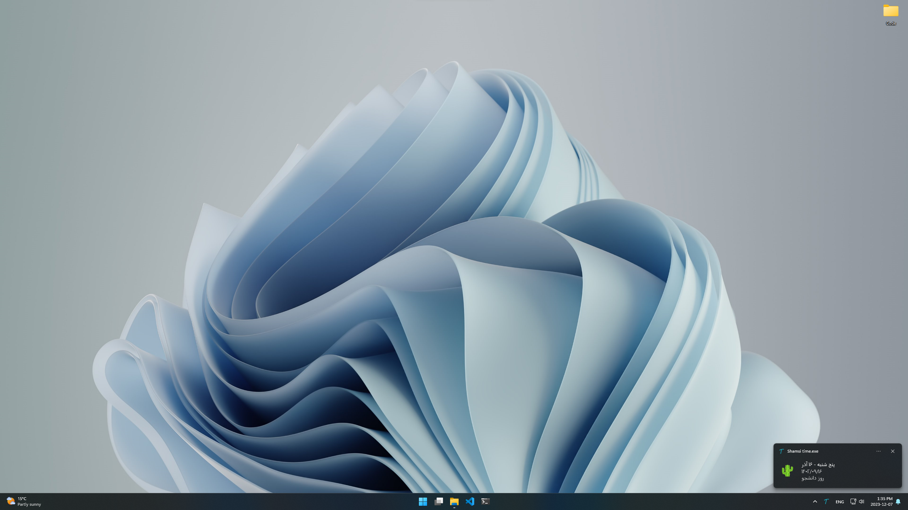
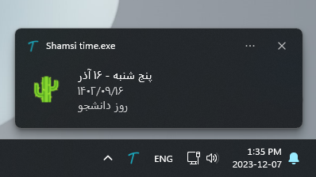

# Shamsi Time

Shamsi Time is a versatile application designed to display the current date in the Persian calendar (Jalali calendar) as a system notification on your desktop. This utility not only provides an easy way to view the current Persian day of the week, month, and date but also offers a new online mode for enhanced functionality.

## Features

-   **Dual Mode Functionality**: Choose between online and offline modes.
    -   **Online Mode**: Retrieves the current time from `time.ir` and caches it for the day. Displays occasions and indicates if it's an official holiday.
    -   **Offline Mode**: If the application is offline or unable to fetch data online, it will automatically switch to offline mode after some time. This mode doesn't display occasions or official holidays.
-   **User Configurable**: Easily switch between online and offline modes through the `config.txt` file.
-   **System Tray Integration**: Displays the Persian date in the system tray for quick access.
-   **Desktop Notifications**: Clicking the tray icon shows a detailed notification with the full date, occasions, and holiday status (in online mode).
-   **Simple Interface**: Right-click menu with an exit option for easy interaction.

## Pre-built Executable

For ease of use, a pre-built executable is available in the Releases section of this repository.

1. Go to the [Releases](https://github.com/m0hammadr3za/shamsi-time/releases) section.
2. Download the latest version of `Shamsi time.exe`.
3. Optionally, to run the application at startup, follow the instructions in the 'Running on Startup' section.

## Building from Source

To build from source or contribute to the project, follow these steps:

1. Clone this repository or download the source code.
2. Navigate to the downloaded folder and run the `build.bat` script. This uses PyInstaller to create a standalone executable from `script.py`.

## Dependencies

-   Python
-   PyQt5
-   jdatetime
-   PyInstaller
-   requests (for online mode)
-   BeautifulSoup4 (for online mode)

## Running on Startup

You can run `script.py` directly if you have the dependencies installed, or you can run the executable built from `script.py`.

### Windows

To run Shamsi Time on startup in Windows:

1. Press Win+R, type `shell:startup`, and press Enter. This opens the Startup folder.
2. Create a shortcut to the `Shamsi time.exe` file in this folder.

### Linux

For Linux systems with a graphical desktop environment:

1. Open the Startup Applications Preferences window.
2. Click Add, then Choose File, and navigate to the `Shamsi time.exe` file.
3. Add a name and comment and click Add.
